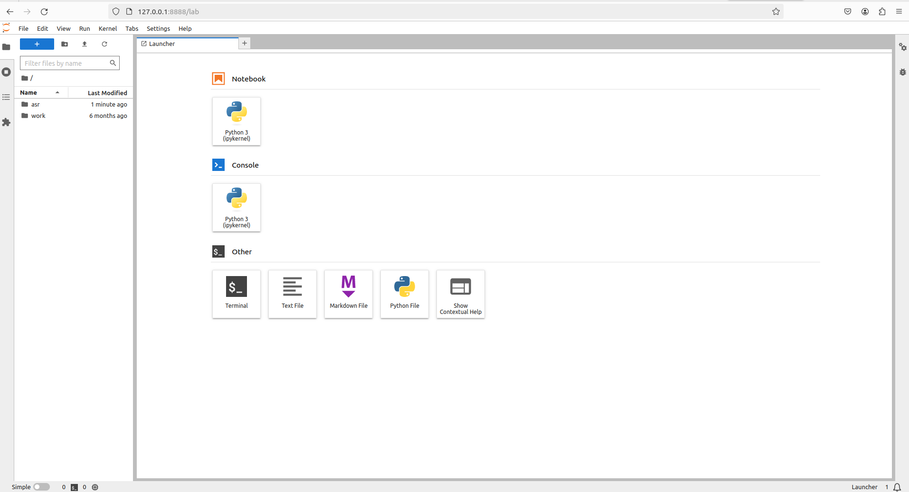

# Setting up environment
In order to setup the environment, we created a dockerfile. Make sure Docker is installed, see https://docs.docker.com/engine/install/.

Confirm Docker is correctly installed and running using:

`docker --version`

Now simply build the container using:

`docker build -t my_notebook_image .`

And run it using:

`docker run -p 8888:8888 my_notebook_image`

This will output something like:

```
To access the server, open this file in a browser:
        file:///home/jovyan/.local/share/jupyter/runtime/jpserver-7-open.html
    Or copy and paste one of these URLs:
        http://37cbc8820e59:8888/lab?token=ff9c475a1912c73d4826973690ba8b391f7ef2f37ae42037
        http://127.0.0.1:8888/lab?token=ff9c475a1912c73d4826973690ba8b391f7ef2f37ae42037
```

Simply go to the second link (the one starting with http://127.0.0.1) and you will see the following:



Simply click on the asr folder on the left and open project.ipynb.